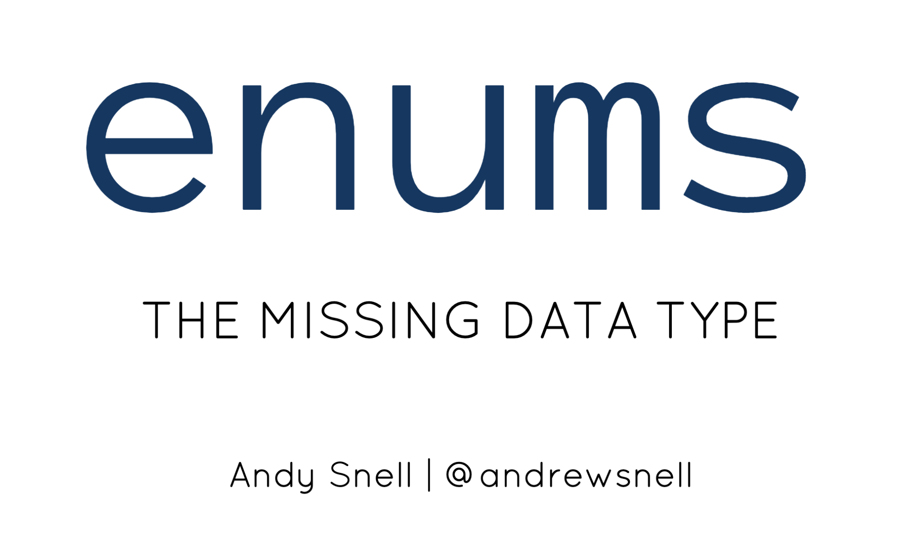

# Enums: The Missing Data Type

PHP may not have a native data type for an Enumerated Type like other 
programming languages, but there are other solutions we can leverage to 
represent a member of a set of values. We’ll see how representing things like 
statuses with enums provides immutability, improved readability, and type safety 
— preventing the kind of errors that happen with “magic strings” and class 
constants. In this session, we’ll be making our own immutable enums from scratch 
in order to explore the concept, but we’ll also introduce some open source 
libraries for use in your production code. We’ll also demystify the 
imposing-sounding “finite state machine” by using using immutable enum objects 
to regulate the transitions between member elements.

## Latest Slides
[](https://bit.ly/37AGwtD)
**PHPBenelux 2020:** [https://bit.ly/37AGwtD](https://bit.ly/37AGwtD)

### Running Code Examples

#### Build Docker Image
```sh
docker build -t enums-example docker/examples/. 
```

#### Run C Example
```
docker run --rm -it -v $PWD:/app enums-example gcc -o bin/enum src/example_enum.c 
docker run --rm -it -v $PWD:/app enums-example ./bin/enum 
```

#### Run Hack Example
```
docker run --rm -it -v $PWD:/app enums-example hhvm src/example_enum.hh
```

#### Run Python Example 
```sh
docker run --rm -it -v $PWD:/app enums-example python3 src/example_enum.py
```

#### Run PHP Tests
```
docker run --rm -it -v $PWD:/app enums-example composer install 
docker run --rm -it -v $PWD:/app enums-example vendor/bin/phpunit tests 
```

## Additional Resources
* See `src/` for code examples, including PHP, C, Hack, and Python
* [Dockerfile](docker/examples/Dockerfile) for Code Examples
* [Dockerfile](docker/splenum/Dockerfile) for SplEnum

### Interesting Userland Package Implementations of Enum Objects
* [myclabs/php-enum](https://github.com/myclabs/php-enum)
* [spatie/enum](https://github.com/spatie/enum)
* [BenSampo/laravel-enum](https://github.com/BenSampo/laravel-enum)
* [dbalabka/php-enumeration](https://github.com/dbalabka/php-enumeration)

### PHP RFCs and Internals Discussions
* [PHP RFC: Enumerated Types](https://wiki.php.net/rfc/enum)
* [Request for Comments: Enum](https://wiki.php.net/rfc/enum?rev=1365505707)
* [Request for Comments: Enum (Previous Version)](https://wiki.php.net/rfc/enum?rev=1302087566)
* https://externals.io/message/52834
* https://externals.io/message/57928
* https://externals.io/message/88293

### Other Resources
* [Wikipedia on Enumerated Types](https://en.wikipedia.org/wiki/Enumerated_type)
* [Martin Fowler - Value Object](https://martinfowler.com/bliki/ValueObject.html)
